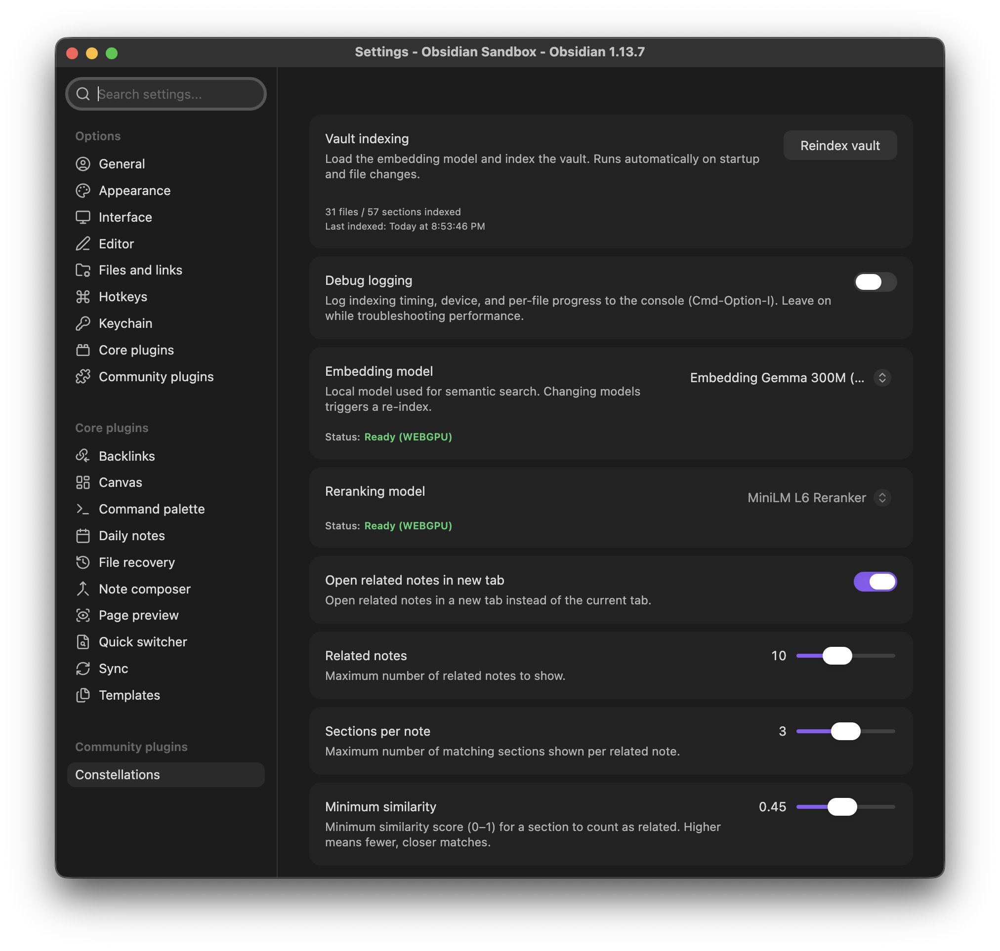

# Constellations

Local-first semantic retrieval and discovery for Obsidian. Constellations indexes your vault on-device into semantic chunks and surfaces related notes, ideas, and passages through focused, contextual exploration.

> **Why "Constellations"?**
> Notes in a vault rarely connect to everything all at once. Instead, ideas naturally gather into distinct clusters — like constellations scattered across the night sky. Constellations illuminates the specific cluster orbiting whatever thought is currently at the center of your attention.

## Screenshots


*The interactive Constellation Graph showing related concepts orbiting your current note.*


*The Related Notes view automatically surfaces semantically relevant notes and exact matching passages as you write.*


*You can also open the Constellation Graph in the sidebar to keep it visible while exploring your vault.*


*Fine-tune the embedding model, reranking model, and search sensitivity directly in the plugin settings. All processing happens 100% locally.*

## Highlights

- **Related Notes View:** Surfaces semantically relevant notes and exact matching passages in real time as you write.
- **Constellation Graph:** An interactive star-topology graph with physics-based semantic distance, optimistic centering, and hover sneak-peeks.
- **Two-Stage Funnel:** Dense vector retrieval refined by an on-device cross-encoder reranker for high precision.
- **100% Local & Private:** Runs entirely on-device via WebGPU/WASM. Zero telemetry, no cloud APIs, no external subscriptions.

## Privacy

- All embedding computation, vector search, and reranking run **locally** on your GPU/CPU.
- The only network access is a **one-time download** of model weights from Hugging Face on first activation (cached locally in your browser/vault cache).
- Vault notes are never transmitted or modified. The index is stored strictly in `.obsidian/plugins/constellations/`.

## Settings

- **Vault indexing:** Manually re-index the vault (runs automatically on startup/changes).
- **Debug logging:** Toggle detailed indexing and performance logs in the developer console.
- **Embedding model:** Choose the semantic model for vector search. `Gemma 300M` for high accuracy, or `All MiniLM L6` for faster performance on older devices. Changing models triggers a re-index.
- **Reranking model:** Shows the active cross-encoder (`MiniLM L6`). Currently cannot be changed; future enhancements may add other models.
- **Matching mode:** Choose how related notes are found (Detailed, Focused, or Broad).
- **Open related notes in new tab:** Open clicked related notes in a new tab instead of the current one.
- **Related notes:** Maximum number of related notes to show.
- **Sections per note:** Maximum number of matching sections shown per related note.
- **Minimum similarity:** Threshold for matches (higher = stricter).

## Commands

| Command | Action |
| :--- | :--- |
| `Open constellation graph` | Opens the full-screen interactive constellation graph |
| `Show related notes` | Toggles the related notes companion sidebar |
| `Reindex notes` | Manually triggers a re-index of new or modified vault notes |

## Development

```bash
npm install
npm test       # run vitest test suite
npm run dev    # watch-mode incremental build
npm run build  # type-check and production bundle
npm run lint   # eslint validation
```

### Manual Testing in Obsidian

1. Run `npm run build` to generate `main.js`.
2. Copy `main.js`, `manifest.json`, and `styles.css` to `<Vault>/.obsidian/plugins/constellations/`.
3. In Obsidian, go to **Settings → Community plugins** and enable **Constellations**.

## Documentation

- [Technical Architecture](docs/architecture.md) — deep dive on the chunking pipeline, index storage, and inference engine.
