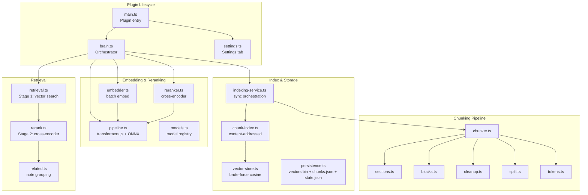
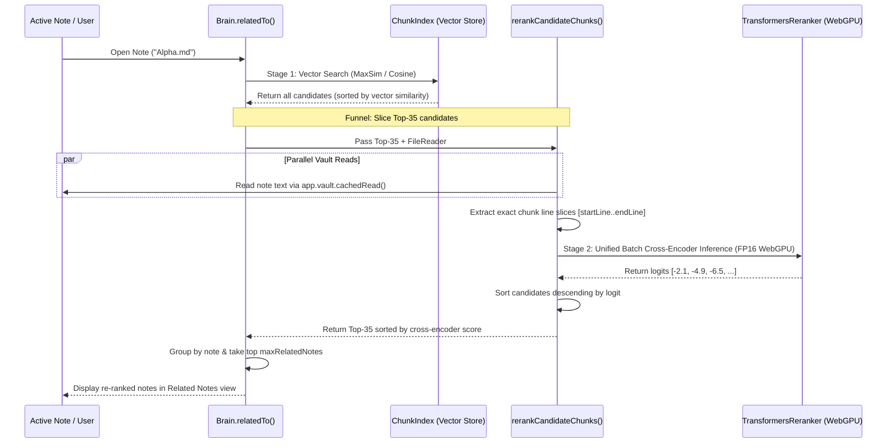

# Constellations — Technical Architecture

Constellations is a local-first semantic retrieval and discovery plugin for Obsidian. It indexes vault notes into content-addressed semantic chunks, computes vector embeddings fully on-device, and surfaces relevant notes using two-stage retrieval (dense vector search funneled into a cross-encoder reranker).

---

## 1. Principles

- **Local-First & Private:** All embeddings and reranking inference execute on-device via WebGPU/WASM. The only network call is a one-time download of model weights from Hugging Face on initial setup. Vault contents never leave the local machine. Zero telemetry, zero cloud dependencies, zero external API keys.
- **Zero Text Duplication:** Note text is never duplicated inside index files. The index stores structural metadata and line coordinates; chunk text is read on demand from vault files.
- **Event-Driven Freshness:** Vault changes (`create`, `modify`, `delete`, `rename`) trigger incremental re-indexing via debounced file events.
- **Desktop-First:** Targeted at desktop platforms running Obsidian on Electron with WebGPU support.
- **Clean Lifecycle:** All event listeners, DOM elements, and intervals register via Obsidian's `register*` helpers for leak-free plugin unloads.

---

## 2. System Stack

| Component | Technology | Details |
| :--- | :--- | :--- |
| **Plugin Core** | TypeScript (strict), esbuild | Compiles to standalone `main.js` |
| **Inference Engine** | `@huggingface/transformers` | ONNX Runtime Web with WebGPU & WASM fallbacks |
| **Default Embedder** | `onnx-community/embeddinggemma-300m-ONNX` | 768 dimensions, 2,048-token context, q4/fp32 |
| **Alternative Embedders** | `Snowflake/snowflake-arctic-embed-xs` `Xenova/all-MiniLM-L6-v2` | 384 dimensions (fast / lightweight options) |
| **Default Reranker** | `Xenova/ms-marco-MiniLM-L-6-v2` | 22M cross-encoder, fp16/fp32 WebGPU |
| **Alternative Reranker** | `Alibaba-NLP/gte-reranker-modernbert-base` | ModernBERT 150M cross-encoder |
| **Vector Store** | In-memory brute-force cosine search | Flat contiguous `Float32Array` buffer |
| **Persistence** | Vault adapter (`.obsidian/plugins/constellations/`) | `vectors.bin`, `chunks.json`, `state.json` |

### Electron & WebGPU Runtime Bridge
Obsidian's Electron renderer includes Node integration, which can cause web-targeted libraries to misidentify the runtime. To ensure `@huggingface/transformers` activates its browser/WebGPU backend (`onnxruntime-web`) rather than Node stubs, the plugin imports `onnxruntime-web/webgpu`, clears the global runtime symbol, and isolates the dynamic import of transformers.js. All execution occurs strictly on-device through browser-compatible APIs.

### Architecture at a Glance

---

## 3. Chunking Pipeline

Markdown notes are parsed hierarchically into bounded semantic blocks with line coordinates:

1. **Heading Sectioning (`splitBySections`):**
   - Notes are split on markdown headings (`#` through `####`), tracking full heading hierarchy breadcrumbs (e.g., `["Note Title", "Heading 1", "Subheading"]`).
   - The source filename is prepended to the breadcrumb unless already matching the top heading.

2. **Block Extraction (`extractBlocks`):**
   - Within each section, content is parsed into atomic semantic units:
     - **List Trees:** Top-level bullets and all indented children remain unified.
     - **Pseudo-headings:** Standalone bold lines (`**Section Name**`) act as block boundaries.
     - **Prose Paragraphs:** Split on blank lines.
   - Every block records exact 0-indexed `startLine` and `endLine` coordinates for direct editor navigation.

3. **Contextual Grouping (`groupBlocks`):**
   - Small adjacent blocks (< 80 tokens) under the same heading are merged up to ~250 tokens to retain semantic context.
   - Substantial blocks (≥ 80 tokens) remain standalone chunks.

4. **Sanitization & Bounding (`mdCleanup` & `forceSplitOversizedBlock`):**
   - Tables are flattened, markdown syntax stripped, whitespace normalized.
   - Blocks exceeding the chunk threshold (`CHUNK_SPLIT_THRESHOLD = 400` tokens) are recursively split on natural delimiters (`\n\n` → `\n` → `. ` → ` `) down to the target bound (`CHUNK_TARGET_MAX = 300` tokens) to preserve semantic coherence and prevent attention bottlenecks during embedding inference.

---

## 4. Indexing & Storage

All index data lives in `<Vault>/.obsidian/plugins/constellations/`:

- **`vectors.bin`:** Contiguous binary `Float32Array` of size `(N_chunks × dimensions)`. Row index maps directly to chunk vector.
- **`chunks.json`:** Array of `ChunkRecord` metadata objects (content hash ID, file path, heading path, startLine, endLine, vectorRow).
- **`state.json`:** Model ID, vector dimension, file content hashes, and index statistics for fast incremental scans and cache invalidation.

### Zero Text Duplication Policy
- Text content is never stored in `chunks.json`. Storing note text in the index would double vault storage on disk.
- Snippet preview and cross-encoder reranking read text directly from note files using `app.vault.cachedRead(file)` and slice by `[startLine..endLine]`.

### Incremental Updates
- When a file changes, only that file is re-chunked.
- Chunk IDs are SHA-1 hashes of cleaned text. Unchanged chunks reuse existing vector rows, avoiding redundant embedding inference.
- Deleted chunks are tombstoned in memory and compacted on index save.

---

## 5. Retrieval Architecture

Retrieval uses a two-stage funnel designed to maximize precision while keeping latency low. 

Modern semantic search pipelines balance two competing forces: retrieval scale (searching 10,000+ chunks in milliseconds using fast vector cosine similarity) and semantic nuance (verifying relevance through deep token-to-token attention). Constellations solves this by casting a wide, fast net in Stage 1, and funneling the top candidates into a high-precision cross-encoder in Stage 2.

### Stage 1: Vector Search Modes
1. **Detailed (MaxSim / All-Pairs) — Default:**
   - Compares every chunk of the active note against all chunks in the vault:
     `Score(doc) = max over active chunks, max over doc chunks (cosine_similarity)`
   - Preserves both source section and target section attribution.
   - Prevents multi-topic notes from diluting into an unrepresentative average.
2. **Focused (Cursor Context):**
   - Matches only the chunk currently containing the user's editor cursor line.
   - Ideal for finding connections to a specific paragraph while writing.
3. **Broad (Mean Vector Pooling):**
   - Compares the document-level centroid against vault chunks for high-level thematic similarity.

### Stage 2: Cross-Encoder Reranking
- **Candidate Funnel:** Takes the top 35 chunks from Stage 1 (`RETRIEVAL_CONFIG.stage1CandidatePoolSize = 35`).
- **Parallel Text Fetch:** Reads candidate files in parallel via `app.vault.cachedRead()` and extracts exact text slices `[startLine..endLine]`.
- **Inference:** Evaluates `(source_text, candidate_text)` pairs in a single batch (`batchSize: 50`) using `Xenova/ms-marco-MiniLM-L-6-v2` on WebGPU with FP16 precision (falling back to FP32).
- **Rescoring & Grouping:** Replaces Stage 1 cosine scores with cross-encoder relevance logits, groups candidate chunks by parent note, applies `maxChunksPerNote`, and outputs top related notes.
- **Graceful Fallback:** If WebGPU or the reranker pipeline encounters an issue, retrieval automatically falls back to Stage 1 vector scores without interrupting the user.
